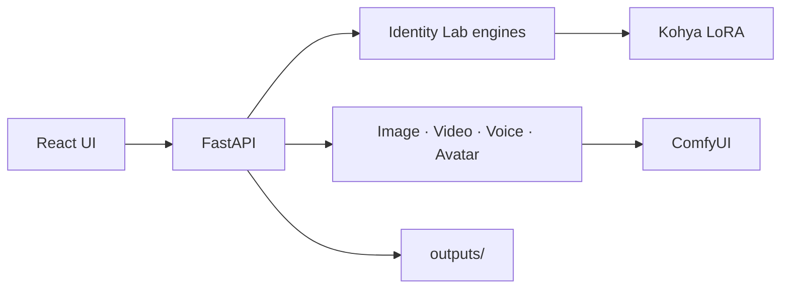

# AI Character Studio

[](./LICENSE)
[](https://www.python.org/)
[](https://fastapi.tiangolo.com/)
[](https://vitejs.dev/)
[](https://github.com/comfyanonymous/ComfyUI)
[](https://github.com/bmaltais/kohya_ss)

> **Fixed-identity AI character pipeline** — train a character once, then generate consistent images, short videos, voice, and talking avatars from the same locked identity.

Built and maintained by **[Gokul Ravi](https://github.com/GokulRavi1)** (`GokulRavi1`).

---

## About the project

AI Character Studio is a full-stack system for **identity-locked generative media**. Instead of one-off prompts that drift every frame, you discover a face, lock body consistency, train a LoRA, and reuse that identity across a Content Studio powered by ComfyUI.

It combines:

- **Identity Lab** — face discovery grids, body consistency sets, dataset prep, Kohya LoRA training
- **Content Studio** — txt2img, hires fix, ControlNet-guided generation
- **Multimodal outputs** — images, AnimateDiff clips, Piper TTS, SadTalker talking avatars
- **Automation** — batch scene generation and shooting guides

Deep dive: **[docs/ARCHITECTURE.md](./docs/ARCHITECTURE.md)**

---

## Features

| Icon | Feature | What you get |
|------|---------|--------------|
| 🧬 | **Character identity lock** | Trigger-word LoRA profiles with metadata, weights, and active character switching |
| 🔍 | **Face discovery** | Systematic grids over angle, lighting, expression, hairstyle, and focal length |
| 🧍 | **Body consistency** | Pose / framing / outfit sets that keep proportions aligned to the chosen identity |
| 🎓 | **LoRA training integration** | Kohya SS config generation, VRAM-aware recommendations, start/stop from the API |
| 🎨 | **ComfyUI orchestration** | Workflow build, queue, poll, and save — including ControlNet and hires paths |
| 🎬 | **Video & avatar** | AnimateDiff reels + Piper TTS + SadTalker lip-sync pipeline |
| 🖥️ | **React dashboard** | Identity Lab + Content Studio (Vite, Context API, Axios) |
| ⚙️ | **Batch automation** | Scene-list generation for repeatable content runs |
| 🗄️ | **Optional Postgres** | Docker Compose with `pgvector` for history / future retrieval |

---

## Use cases

| Audience | Example |
|----------|---------|
| **Virtual influencers / creators** | One trained face across weeks of on-brand stills and short reels |
| **Film & pre-visualization** | Consistent character looks for boards, animatics, and pitch decks |
| **Games & interactive media** | NPC / hero identity locked for concept art and dialogue avatars |
| **Brand & product storytelling** | Repeatable spokesperson avatar with voice + lip-sync |
| **ML / creative-tech builders** | Reference pipeline for LoRA ops, ComfyUI API design, and studio UIs |

---

## Architecture (preview)



Full stack diagram, service map, data flows, and project tree → **[Architecture docs](./docs/ARCHITECTURE.md)**

---

## Project structure

```text
AI_CREATOR_MODEL/
├── backend/           # FastAPI — services, routers, utils
├── ui/                # React + Vite dashboard
├── automation/        # Batch generation & face discovery helpers
├── workflows/         # ComfyUI workflow JSON
├── scripts/           # Download / verify helpers
├── docs/              # Architecture and design notes
├── models/            # Local checkpoints & character LoRAs (gitignored)
├── datasets/          # Training images (gitignored)
├── outputs/           # Generated media (gitignored)
├── config.yaml        # Central configuration
├── docker-compose.yml # Optional Postgres + pgvector
├── requirements.txt
└── LICENSE            # MIT
```

---

## Quick start

### Requirements

| Component | Minimum | Recommended |
|-----------|---------|-------------|
| GPU | NVIDIA 6 GB VRAM | NVIDIA 12 GB+ |
| RAM | 16 GB | 32 GB |
| Storage | 40 GB SSD | 100 GB+ SSD |
| Python | 3.10+ | 3.10.x |
| Node.js | 18+ | 20.x |
| OS | Windows 10/11, Linux, macOS* | Windows 11 / Linux |

\*GPU paths assume NVIDIA + CUDA for ComfyUI training/inference.

### 1. Clone

```bash
git clone https://github.com/GokulRavi1/AI_CREATOR_MODEL.git
cd AI_CREATOR_MODEL
```

### 2. Python environment

```bash
python -m venv venv

# Windows
venv\Scripts\activate

# Linux / macOS
# source venv/bin/activate

pip install -r requirements.txt
```

### 3. Configure

```bash
# Windows
copy .env.example .env

# Linux / macOS
# cp .env.example .env
```

Edit `.env` and `config.yaml` for ComfyUI host/port, output paths, and training defaults.

### 4. External runtimes (required for generation)

| Runtime | Purpose |
|---------|---------|
| **[ComfyUI](https://github.com/comfyanonymous/ComfyUI)** | Image / video inference (`config.yaml` → `comfyui.host` / `port`, default `8188`) |
| **[Kohya SS](https://github.com/bmaltais/kohya_ss)** | LoRA training |
| **Piper TTS** / **SadTalker** | Voice + talking avatar (install when you use those endpoints) |

Do **not** commit large `ComfyUI/` or `kohya_ss/` trees. Cloud LoRA tips: [CLOUD_TRAINING.md](./CLOUD_TRAINING.md).

### 5. Start the API

```bash
python -m uvicorn backend.main:app --reload --host 0.0.0.0 --port 8000
```

- API / docs: [http://localhost:8000/docs](http://localhost:8000/docs)
- Health: `GET /api/health`

### 6. Start the UI

```bash
cd ui
npm install
npm run dev
```

Open [http://localhost:5173](http://localhost:5173) — the Vite app proxies `/api` to the backend.

### 7. Optional database

```bash
docker compose up -d
```

Starts Postgres with `pgvector` (see `docker-compose.yml`).

---

## How to use (workflow)

1. **Create a character** in Identity Lab (name, description, trigger word).
2. **Run face discovery** — review the variation grid and select the best identity.
3. **Generate a body consistency set** and promote keepers into the dataset.
4. **Prepare the dataset** — resize, caption, validate (`dataset_tools` / UI helpers).
5. **Train a LoRA** via Kohya (local or cloud) and register the `.safetensors` on the character.
6. **Generate in Content Studio** — prompts, ControlNet, hires; keep the same active character.
7. **Optional** — short video (AnimateDiff), TTS, or talking avatar; or batch jobs under `automation/`.

---

## API overview

| Method | Endpoint | Description |
|--------|----------|-------------|
| `GET` | `/api/health` | System health |
| `POST` | `/api/generate/image` | Character image |
| `POST` | `/api/generate/video` | Short video / reel |
| `POST` | `/api/generate/voice` | Text-to-speech |
| `POST` | `/api/generate/avatar` | Talking avatar |
| `POST` | `/api/prompt/build` | Preview constructed prompt |
| `GET` | `/api/models` | List models |
| `GET` | `/api/outputs/{category}` | List outputs |
| `GET` | `/api/presets` | UI presets |
| `POST` | `/api/cleanup/{category}` | Clean old outputs |

Interactive OpenAPI: [http://localhost:8000/docs](http://localhost:8000/docs)

---

## Experiment succession

A narrative of how the system was built — what each phase unlocked.

| Phase | Focus | What we learned / shipped |
|-------|--------|---------------------------|
| **0 — Foundation** | Repo layout, FastAPI shell, config, env template | A single `config.yaml` + service modules beat a pile of one-off scripts. |
| **1 — Identity lock** | Dataset discipline + Kohya LoRA | Consistency starts *before* fancy prompts: angles, captions, and a clear trigger word. |
| **2 — Image generation** | ComfyUI client, ControlNet, prompt presets | Orchestrating ComfyUI over HTTP made the product UI independent of graph editing. |
| **3 — Motion** | AnimateDiff short clips | Short, identity-aware reels needed the same LoRA path as stills — not a separate “video character.” |
| **4 — Speech & avatar** | Piper TTS + SadTalker | Voice and lip-sync are downstream of a stable face; weak identity upstream breaks avatars. |
| **5 — Automation** | Batch scene lists | Once identity is locked, content volume becomes a scheduling problem, not a quality reinvent. |
| **6 — Studio UI** | React Identity Lab + Content Studio | Operators need discovery → train → generate as one loop, not three disconnected tools. |

**Succession takeaway:** treat **identity as a product primitive**. Face discovery and body consistency exist so LoRA training and ComfyUI generation inherit the same person — every later modality (video, voice, avatar, batch) rides on that lock.

---

## Roadmap status

| Phase | Module | Status |
|-------|--------|--------|
| 0 | Project setup & backend | Complete |
| 1 | Character identity lock (LoRA) | Complete |
| 2 | Image generation (ComfyUI) | Complete |
| 3 | Video / reel (AnimateDiff) | Complete |
| 4 | Talking avatar (SadTalker + TTS) | Complete |
| 5 | Batch automation | Complete |
| 6 | Full UI dashboard | Complete |

---

## Contributing

Issues and pull requests are welcome.

1. Fork the repo and create a feature branch.
2. Keep secrets, datasets, weights, and `outputs/` out of git.
3. Prefer small, focused PRs with a clear problem statement.
4. Match existing Python / React style in the touched modules.

---

## Author

**Gokul Ravi** — [`GokulRavi1`](https://github.com/GokulRavi1)

- Repository: [github.com/GokulRavi1/AI_CREATOR_MODEL](https://github.com/GokulRavi1/AI_CREATOR_MODEL)

---

## License

This project is released under the [MIT License](./LICENSE).

```
Copyright (c) 2026 Gokul Ravi
```

You may use, modify, and distribute freely, provided the copyright and license notice are retained.
