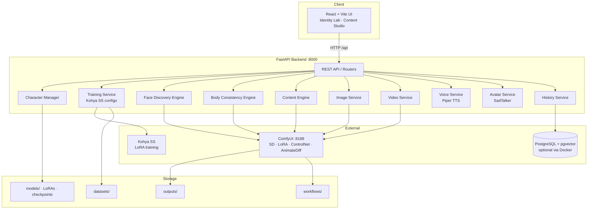

# Architecture

Technical blueprint for **AI Character Studio** — identity-locked character generation across images, video, voice, and talking avatars.

---

## Stack diagram



---

## Service map

| Service | Path | Responsibility |
|---------|------|----------------|
| **Character Manager** | `backend/services/character_manager.py` | Create/load/update characters, active identity, LoRA registration |
| **Training Service** | `backend/services/training_service.py` | Kohya configs, recommended presets by VRAM, start/stop training |
| **Face Discovery Engine** | `backend/services/face_discovery_engine.py` | Systematic face grids (angle, light, expression, lens) for identity pick |
| **Body Consistency Engine** | `backend/services/body_consistency_engine.py` | Pose / framing / outfit sets that keep the same body identity |
| **Content Engine** | `backend/services/content_engine.py` | Studio workflows: txt2img, hires fix, ControlNet |
| **ComfyUI Client** | `backend/services/comfyui_client.py` | Workflow build, queue, poll, image fetch |
| **Image / Video / Voice / Avatar** | `backend/services/*_service.py` | Modality-specific generation APIs |
| **History Service** | `backend/services/history_service.py` | Generation logging and history queries |
| **Prompt Builder** | `backend/utils/prompt_builder.py` | Camera / lighting presets and prompt assembly |
| **Dataset Tools** | `backend/utils/dataset_tools.py` | Resize, caption, validate, analyze training sets |
| **Batch Automation** | `automation/batch_generate.py` | Scene-list batch generation |
| **Face Discovery CLI** | `automation/face_discovery.py` | Shooting guides and discovery helpers |

---

## Data flow

### 1. Identity lock (train once)

```text
Describe character
    → Face Discovery (variation grid)
    → Select best identity
    → Body Consistency set → dataset
    → Dataset tools (resize / caption / validate)
    → Kohya LoRA training
    → Register character.safetensors on the character profile
```

### 2. Content generation (reuse identity)

```text
Active character + prompt (+ optional ControlNet)
    → FastAPI service builds ComfyUI workflow
    → ComfyUI runs SD + LoRA (+ ControlNet / AnimateDiff)
    → Results saved under outputs/
    → History logged (optional DB)
```

### 3. Talking avatar path

```text
Script text
    → Piper TTS → audio
    → SadTalker + character face/reference
    → Lip-synced avatar video in outputs/avatars/
```

---

## Frontend architecture

| Layer | Choice |
|-------|--------|
| Framework | React + Vite |
| Styling | Vanilla CSS (dark studio theme) + Lucide icons |
| State | Context API (`AppContext`) |
| HTTP | Axios → proxies `/api` → `http://127.0.0.1:8000` |
| Main surfaces | Identity Lab (discovery + training), Content Studio (canvas + ControlNet) |

Dev UI: `http://localhost:5173`  
API: `http://localhost:8000`

---

## Project tree

```text
AI_CREATOR_MODEL/
├── backend/                 # FastAPI application
│   ├── main.py              # App entry + primary routes
│   ├── config.py            # Loads config.yaml / env
│   ├── database/            # Models, session, init
│   ├── routers/             # e.g. history
│   ├── services/            # Generation & identity engines
│   └── utils/               # Prompts, files, dataset tools
├── ui/                      # React + Vite dashboard
│   └── src/
│       ├── components/
│       ├── context/
│       └── hooks/
├── automation/              # Batch + discovery scripts
├── workflows/               # ComfyUI workflow JSON
├── scripts/                 # Model download / verify helpers
├── models/                  # Checkpoints, LoRAs, characters (local)
├── datasets/                # Training images (local)
├── outputs/                 # Generated media (local)
├── docs/
│   └── ARCHITECTURE.md      # This file
├── config.yaml              # Central runtime config
├── docker-compose.yml       # Optional Postgres + pgvector
├── requirements.txt
├── LICENSE                  # MIT
└── README.md
```

---

## Configuration surface

| Source | Purpose |
|--------|---------|
| `config.yaml` | ComfyUI host/port, generation defaults, LoRA training knobs, voice/avatar/video engines, output paths, server bind |
| `.env` / `.env.example` | Secrets and environment overrides |
| Character `metadata.json` | Per-identity trigger word, LoRA path/weight, dataset path |

---

## External dependencies (runtime)

| Component | Role | Typical port |
|-----------|------|--------------|
| **ComfyUI** | Diffusion inference backend | `8188` |
| **Kohya SS** | LoRA training | CLI / local install |
| **Piper TTS** | Offline speech | local |
| **SadTalker** | Talking-head animation | local |
| **PostgreSQL + pgvector** | Optional history / vectors | `5432` (Docker Compose) |

Large third-party trees (`ComfyUI/`, `kohya_ss/`) are **not** shipped in this repo — install them locally or in the cloud. See `CLOUD_TRAINING.md` for Colab / Kaggle notes.

---

## Design principles

1. **Identity first** — train and lock a character before mass content generation.
2. **API-orchestrated inference** — FastAPI owns product logic; ComfyUI owns GPU graphs.
3. **Modality modules** — image, video, voice, and avatar stay replaceable services.
4. **Reproducible configs** — central YAML + per-character metadata, not hard-coded paths in UI.
5. **Local-first open source** — run on your GPU; optional cloud training for LoRAs.
